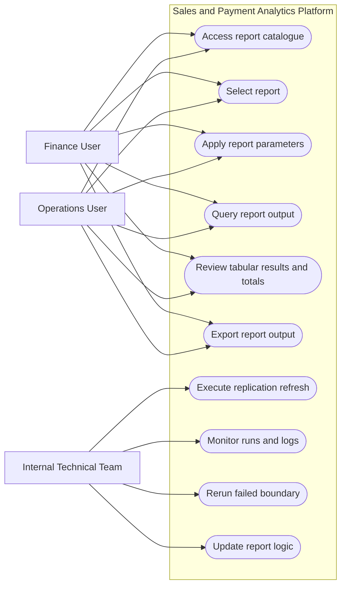

# Analysis And Design

## Introduction

This chapter presents the analysis and design of the Marrybrown Sales and Payment Analytics Platform. The chapter translates the problem statement and project objectives into concrete requirements and design artefacts, covering system analysis, system requirements, current system analysis, and detailed system design. The academic basis for the design choices, including replication-first traceability, ELT, semantic/API layering, reconciliation, and iterative delivery, has been established in Chapter 2, while Chapter 3 described the methodology used to implement and validate the platform.

## System Analysis

### Case Study Context (Continuity Reporting for Sales and Payments)

The case study concerns sales and payment reporting in a large-scale food and beverage (F&B) retail setting where transaction processing and reporting access are provided through an externally managed POS environment and reporting portal. Continuity reporting is operationally important for Finance users, particularly for reconciliation and month-end closing, and for Operations users, particularly for outlet-level monitoring and exception review. In this context, the core system problem is that report access is mediated through vendor-managed interfaces and exports, which can constrain ad hoc investigation and introduce operational risk when the portal is unavailable or slow to respond.

### Stakeholders and Role-Based View

Stakeholders are represented in a role-based manner to clarify reporting needs without asserting an official organisation chart.

| Stakeholder group | Primary activities | Reporting needs (examples) |
| --- | --- | --- |
| Finance users | Reconciliation, month-end closing, audit preparation | Payment breakdowns, voucher redemption visibility, return and cancellation checks, export-ready report outputs |
| Operations users | Outlet performance monitoring, operational oversight | Outlet-level report access, channel-specific sales views, exception visibility, report filtering by period and location |
| Internal technical team | Platform maintenance and enhancement | Traceability, rerun support, controlled report-logic updates, replication monitoring, operational administration |

*Table 4.1: Stakeholder groups and reporting needs (role-based view)*

### System Requirements Gathering Techniques

Requirements were derived through document analysis of vendor portal reports and exported files, together with stakeholder feedback and clarification sessions with Finance and Operations users. This approach is consistent with a black-box reporting environment in which proprietary report rules must be inferred from observable inputs and outputs rather than from a complete vendor specification. No survey instruments or formal interview claims are made; instead, the emphasis is on traceable artefacts such as exports, parameter settings, expected totals, and user-accepted report behaviour.

### Use Case Diagram

The principal interactions between user roles and the platform can be summarised through a use case view. As shown in Figure 4.1, Finance and Operations users interact with the platform through six core use cases: access the report catalogue, select a report, apply report parameters, query the report output, review tabular results and totals, and export report outputs for reconciliation or operational follow-up. The internal technical team supports the platform through four operational use cases: execute replication refreshes, monitor runs and logs, rerun failed boundaries, and update report logic in a controlled manner. This use case view provides an analysis-level summary of the actor-system interactions before the more detailed design discussion in later sections.

*Figure 4.1: Use case diagram for the Marrybrown Sales and Payment Analytics Platform (illustrative)*

### User Requirement Outcomes

The requirement-gathering activities produced more specific outcomes than a general need for report access. For Finance and Operations users, the analysis indicated that the platform had to preserve the practical behaviour of the vendor portal: a familiar report catalogue, parameter-driven retrieval, consistent option sets for shared parameters, exact tabular outputs for checking, and exportable results that could be used directly in reconciliation and month-end workflows. The findings also indicated that continuity reporting was prioritised over exploratory analytics, which is why detailed tables, totals, and export functions are treated as core interface outcomes rather than optional features.

For the internal technical team, the main outcomes concerned maintainability, traceability, and controlled operations. The platform had to preserve source-aligned replicated data, support vendor-equivalent rule implementation through SQL queries executed by the semantic/API layer, reuse common parameter and export logic across reports where possible, and provide controlled rerun, monitoring, and refresh support when replication or validation issues occurred. These outcomes provide the practical basis for the functional and non-functional requirements formalised in the next section and for the design decisions presented later in this chapter.

## System Requirements

### Functional Requirements (FR)

The functional requirements are summarised in Table 4.2.

| ID | Functional requirement |
| --- | --- |
| FR1 | The system shall replicate relevant sales and payment datasets from the external POS environment into a company-owned SQL Server reporting database through controlled refresh processes. |
| FR2 | The system shall reconstruct and generate company-required sales and payment reports based on the replicated datasets. |
| FR3 | The system shall provide report filtering by report-specific parameters, at minimum date range and outlet scope where applicable. |
| FR4 | The system shall provide tabular report outputs, totals or subtotals where required, and export support for reconciliation workflows. |
| FR5 | The system shall expose report logic through an API layer so that the frontend remains decoupled from underlying database structures. |
| FR6 | The system shall support controlled refresh-related administrative actions, including rerun or follow-up handling for reporting data updates. |

*Table 4.2: Functional requirements for the platform*

### Non-Functional Requirements (NFR)

The non-functional requirements are summarised in Table 4.3.

| ID | Non-functional requirement |
| --- | --- |
| NFR1 | Data fidelity and traceability: report outputs shall remain traceable to replicated source records and support reconciliation checks. |
| NFR2 | Availability: the platform shall provide an internal reporting path when vendor portal access is disrupted or operationally inconvenient. |
| NFR3 | Performance (operational usability): report responses shall be delivered within an acceptable time for reporting-intensive workflows such as month-end closing. |
| NFR4 | Security: the platform shall operate as a read-only reporting environment and implement appropriate access control. |
| NFR5 | Maintainability: report logic shall be structured to support iterative refinement when edge cases, missing data conditions, or rule changes are discovered. |
| NFR6 | Auditability: refresh activity, validation outcomes, and report-serving behaviour shall be sufficiently observable to support operational follow-up. |

*Table 4.3: Non-functional requirements for the platform*

### Constraints and Assumptions

The platform was designed under several constraints and assumptions. Access to the external POS environment was restricted and read-only from the perspective of the reporting platform. The platform was intended for reporting continuity and internal operational access rather than write-back interaction with the vendor POS system. The refresh cadence was designed to support operational reporting needs rather than real-time transactional processing. Historical completeness was also dependent on approved replication boundaries and the treatment of late corrections. Design decisions in this chapter therefore prioritise traceability, repeatability, and controlled reporting operations over transactional immediacy.

## Current System Analysis

The original reporting workflow relied on a vendor-managed reporting portal as the primary interface for sales and payment reports. Users typically selected a report, applied parameters such as outlet and date range, and exported results for reconciliation activities. This workflow constrained ad hoc analysis because users could not freely query underlying transactional records, and operational reporting could be disrupted if portal access degraded during reporting-intensive periods. Issue resolution was also dependent on vendor support processes, which did not always align with internal reporting timelines.

*Figure 4.2: Current vendor-dependent reporting workflow (simplified)*

## System Design

### System Architecture

The platform is organised as an end-to-end analytical flow comprising six connected stages: vendor-managed POS data sources, selective replication and ELT, a company-owned SQL Server replica, a semantic/API layer, a reporting portal, and Finance and Operations users. This structure preserves source-aligned data in the replica while centralising report rules, validation logic, and delivery behaviour at the FastAPI service layer, consistent with the replication and semantic-layer rationale discussed in Chapter 2.

As shown in Figure 4.3, the architecture begins with vendor-managed transactional data and vendor report outputs, which feed a selective boundary-based replication and ELT process into the company-owned SQL Server replica. The FastAPI semantic layer then applies report rules and validation over the replicated data before the reporting portal presents report lists, parameter-driven retrieval, tabular outputs, and export functions to Finance and Operations users. In this way, the architecture delivers continuity reporting through a company-controlled path while preserving separation between data acquisition, storage, business-rule processing, and presentation.

*Figure 4.3: Logical architecture of the analytics platform*

### Component Explanations

Table 4.4 summarises each component's responsibility and key design considerations. These component-level responsibilities are aligned with the literature reviewed in Chapter 2, particularly the discussions on replication-based analytical stores, ELT workflows, semantic layers, service interfaces, and operational reporting portals.

| Component | Responsibility | Key design considerations |
| --- | --- | --- |
| External POS environment | Source of transactional records and baseline report behaviour | Access constraints; parameter consistency; late corrections |
| Replication / ELT processes | Extract and load source data into the replica | Idempotent refresh boundaries; logging; rerun controls; quality checks |
| SQL Server replica | Store 1:1 replicated tables and support report queries | Traceability; indexing strategy; retention boundaries; reporting-readiness |
| FastAPI semantic layer | Encapsulate report rules and expose stable report endpoints | Versioned business rules; parameter validation; consistent metric definitions; controlled access |
| Reporting portal | Provide internal report access, export, and limited administrative operations | Usability during reporting periods; consistent filtering; totals/subtotals; operational visibility |

*Table 4.4: Component responsibilities and design considerations*

### Report Coverage Overview

The platform design was not limited to a single dashboard or a small number of isolated queries. It was structured to support a formal implementation scope comprising 19 sales and payment reports, together with three additional customised reports requested during implementation. At design level, these reports can be grouped into several functional categories, as summarised in Table 4.5 and Table 4.6. Detailed per-report specifications are provided in Appendix A.

| Report category | Formal implementation/business-scope reports | Main design implications |
| --- | --- | --- |
| Sales and exception control | Sales Return Report; Sales Cancelled Report; DELETED Items Report; Pickup & Declaration Report; [SOK] Each Kiosk Transaction Report | Requires transaction-status handling, traceability to sale-level records, and exact tabular outputs for checking and audit follow-up |
| Payment and voucher reconciliation | Payment type (All Payment); MB Cash Voucher (with Barcode) Redemption Report; MB Staff E - Voucher RM 20 & MB CASH VOUCHER RM10 (with Barcode) Redemption Report | Requires payment-to-sale linkage, voucher normalisation, and export fidelity for reconciliation workflows |
| Delivery and ordering channels | Sale Delivery (By Sales Type) Ex Tax Calculation; Delivery - FoodPanda, Grabfood, ShopeeFood; Foodpanda Sales; Foodpanda Discount; Mobile Ordering Sales | Requires channel classification, period-based filtering, and consistent grouping rules across delivery and ordering sources |
| Product, stock, and cost analysis | Product Mix Report; Product Mix with modifier without ETL; Stock Variance Report (Latest); Xilnex - Monthly Checking - COGS by Item (By Sales Type) | Requires item-level granularity, reference-data support, and careful handling of derived values such as cost, quantity, and profit-related measures |
| Service and operational timing | Average SOS Report (New) | Requires timing-oriented aggregation over KDS-backed sales activity and store-level operational performance interpretation |
| Discount monitoring | Discount Remark Report | Requires discount-level traceability, remark handling, and alignment between discount records and sales context |

*Table 4.5: Formal implementation/business-scope report groups and design implications*

| Additional customised report | Reporting purpose | Design relationship to the shared platform |
| --- | --- | --- |
| Roblox Free Chicken Burger Combo Sales | Tracks a company-requested campaign report for a specific promotional sales scenario | Reuses the same parameter, query, export, and portal delivery pattern as the formal report set |
| Voucher Campaign & Reward Sales | Tracks voucher-campaign and reward-related sales activity requested during implementation | Extends the shared semantic/API design with campaign-focused grouping and output rules |
| Promotion Item Additional Purchase Report | Analyses additional-purchase behaviour for configured promotion items | Reuses the shared reporting workflow while extending the design with configurable promotion-item categorisation |

*Table 4.6: Additional customised reports and their relationship to the shared platform design*

### Data Engineering and API Design

#### Data Sources and Replication Boundary

The primary data source is the vendor-managed POS transactional database, which is accessed for read-only replication into the company-owned SQL Server environment. At a logical level, the source data required by the report set can be grouped into transaction-header records, line-item records, payment or tender records, and supporting master or reference data. Transaction-header data provides the reporting grain and status context for each sale, line-item data supports item-level analysis and quantity or amount breakdowns, payment data supports payment-type reporting and reconciliation, and master or reference data such as outlet and item attributes is required to interpret and group transactional records consistently.

Replication boundaries were defined report by report by tracing required output columns and business rules back to the minimum set of source tables needed for reconstruction. In the implemented environment, transactional replication prioritised the operational history required by the report set, while smaller reference datasets were retained more broadly because they were required to interpret transactions consistently across reporting periods. This selective but fidelity-preserving boundary supports operational reporting windows while allowing late corrections to be refreshed during subsequent runs.

#### Refresh Cadence and Idempotent Load Pattern

The ELT workflow was designed to refresh operational data in a controlled manner and to account for late corrections such as voids, adjustments, and return postings. The implemented design supports both portal-triggered refresh activity for operational follow-up and scheduled ETL refreshes for routine reporting maintenance. This design operationalises the ELT and idempotent-load principles discussed in Chapter 2, where controlled load boundaries and deterministic reruns are identified as the basis for repeatable refresh cycles.

Within each refresh boundary, existing rows for the affected reporting window are removed from the replica and then re-inserted from a fresh extract. This design ensures that rerunning the same boundary yields a consistent replicated state and supports recovery when extraction or load failures occur. As illustrated in Figure 4.4, the refresh and report-serving sequence can be described in two stages. During the refresh stage, the ELT process extracts source transactions for a defined boundary window, refreshes the corresponding rows in the SQL Server replica, and performs post-load checks. During the report-serving stage, the portal submits a report request with user-specified parameters, the API queries the refreshed replica and applies semantic rules, and the resulting rows, totals, and export-ready output are returned to the portal. This separation clarifies that replication and report serving are linked operationally but remain distinct responsibilities within the overall platform design.

*Figure 4.4: Boundary-based refresh and report-serving sequence (illustrative)*

#### Operational Controls, Logging, and Data-Quality Checks

Operational controls were designed to support reliability, recovery, and reporting trustworthiness. At design level, these controls include logging of refresh outcomes, post-load checking, source-to-replica quality verification for selected reporting windows, and rerun capability for specific boundaries. These controls ensure that the replicated state can be monitored and trusted before it is used for report reconstruction. The detailed implementation and operational handling of these controls are presented in Chapter 5.

#### API Endpoint Pattern and Semantic Layer Responsibilities

The API layer acts as a semantic layer that encapsulates reconstructed business rules and provides a stable interface to the reporting portal. Report endpoints follow a consistent pattern built around date-range parameters, outlet-scope parameters where relevant, and report-specific optional filters. For each endpoint, the design specifies required and optional parameters, the output schema, totals or subtotals where required, formatting rules, and the expected validation approach.

This design reflects the semantic-layer and service-interface concepts discussed in Chapter 2. Replicated data are retained close to source structure for traceability, while report-specific business rules, derived fields, and delivery behaviour are centralised at the API layer. The API therefore decouples report consumption from underlying storage design and keeps report logic more maintainable, versioned, and auditable.

#### Security Considerations

The platform is designed as a read-only reporting environment. Authentication and authorisation are applied to ensure that only authorised users can retrieve reports or access role-restricted administrative functions. Query parameters are also validated so that report access remains bounded by the intended workflow and organisational reporting policy.

#### Report Reconstruction Overview

Report reconstruction follows a repeatable workflow: define report inputs and filters, identify contributing replicated datasets, implement vendor-aligned business rules at the semantic layer, aggregate and format outputs into a stable schema, and validate parity against vendor outputs. This workflow is shared across the formal report set and the additional customised reports, even though each report has its own business rules and output structure.

At Chapter 4 level, the main design point is that the platform supports multiple report types through a shared semantic/API pattern rather than through unrelated one-off queries. Reports differ in grouping logic, filters, and output fields, but they follow the same overall design principles of traceable replicated data, parameter-driven retrieval, stable tabular output, and export-oriented delivery. Detailed implementation examples and validation journeys are presented in Chapter 5, while detailed per-report specifications are provided in Appendix A.

### Database Design

The data design adopts a 1:1 replication strategy, in which the company-owned database mirrors relevant transactional tables from the external POS environment. This strategy prioritises fidelity and traceability to support reconciliation and parity validation. It is also aligned with the schema-on-read rationale discussed in Chapter 2, where duplicated transactional data are retained close to source structure for traceability, while report-specific calculations and derived logic are handled separately at the semantic/API layer.

As illustrated in Figure 4.5, the conceptual model centres on sales headers, sales items, payments, and supporting reference entities such as location and item master data. This model is intended to show the main reporting entities and relationships at a conceptual level rather than to expose vendor-specific physical table names.

*Figure 4.5: Simplified conceptual data model for sales and payment reporting (illustrative)*

Table 4.7 summarises the main conceptual entities required by the report set. Physical table names and column names in the replicated schema are vendor-specific; the design intent is to preserve a 1:1 representation while documenting join paths and key attributes used in report logic.

| Entity | Purpose in reporting | Representative attributes (conceptual) |
| --- | --- | --- |
| Sales (header) | Defines the reporting grain for sales totals, date scoping, and status handling | Sale identifier; business date; outlet/location key; sales status; totals |
| Sales item (line) | Supports item-level reporting, quantity analysis, and return or adjustment detection | Sale identifier; item code or name; quantity; net amount; tax fields |
| Payment | Supports payment type breakdown, voucher handling, and reconciliation | Sale identifier; payment method; amount; device or reference fields |
| Location | Maps location identifiers to outlet names and outlet-scope filtering | Location key; location name; hierarchy attributes where applicable |
| Item master | Provides item metadata and grouping attributes | Item code or name; category; group; division attributes |

*Table 4.7: Conceptual data dictionary (summary)*

### Business Rule Reconstruction for the Formal Report Set

Although the replicated database preserves source-aligned transactional structures, the business rules for the formal sales and payment report set are reconstructed and applied within the semantic/API layer rather than embedded in the storage layer. This separation allows the replica to remain close to source structure for traceability, while report-specific logic is centralised above the database layer for maintainability and auditability.

The semantic/API design supports the report set through a common service pattern. Each report is exposed through a dedicated endpoint, but follows a shared response and delivery approach based on flat-list outputs, common parameter parsing behaviour, and consistent export handling. Shared parameter logic is reused where reports expose the same option sets, while report-specific extensions allow additional filters such as item division, group name, channel classification, campaign criteria, or department where required.

In this project, business-rule reconstruction refers to inferring vendor-aligned reporting rules from observed portal outputs and implementing those rules as SQL queries executed by FastAPI over the 1:1 replicated data. The semantic/API layer therefore applies report-specific selection, grouping, aggregation, and formatting logic without changing the underlying replicated structure. Appendix A documents the detailed per-report specifications. Within the main design chapter, the emphasis is therefore on the shared reconstruction pattern and service-layer responsibilities rather than repeating each individual report specification in full.

### Interface Design

The portal is designed to mirror the existing user workflow for continuity reporting while providing more controlled internal access to report selection, parameter entry, report retrieval, and export. The primary interaction is: authenticate, select report, set parameters, view results with totals or subtotals where relevant, and export outputs for reconciliation or operational review. In addition to ordinary report retrieval, the portal design also accommodates role-restricted administrative views such as user administration and refresh-related operational oversight.

As illustrated in Figure 4.6, the report-list view is designed to support report discoverability and selection through a structured catalogue of available reports. This interface allows users to identify the required report quickly, recognise its reporting purpose from the accompanying description, and navigate into the relevant reporting screen without relying on vendor-managed menus.

*Figure 4.6: Report list interface (illustrative)*

As illustrated in Figure 4.7, the reporting view combines parameter controls, query execution, summary indicators, tabular output, and export actions within a single workflow. This design enables users to specify report parameters, retrieve vendor-aligned outputs, inspect key totals or subtotals, and export the result for reconciliation or further review. Rather than prioritising chart-heavy dashboards, the interface emphasises summary indicators and detailed tabular presentation because the project objective is continuity reporting and parity-aligned operational access rather than exploratory visual analytics.

*Figure 4.7: Reporting interface (illustrative)*

Figure 4.8 provides a simplified workflow view of the overall portal interaction, linking login, report discovery, report selection, parameter entry, result inspection, export, and downstream reconciliation. While Figures 4.6 and 4.7 show specific interface states, Figure 4.8 summarises the intended end-to-end navigation path so that the relationship between report selection and report consumption can be understood at a glance.

*Figure 4.8: Portal navigation and report workflow (illustrative)*

Because the delivered system also included role-restricted operational administration, the interface design was not limited to ordinary report-consumption pages alone. As illustrated in Figure 4.9, the administrative interface design groups Data Sync, Automation Control, and User Management into a controlled support surface so that authorised users can handle replication follow-up, automation oversight, and access administration within the same portal environment. This figure should be presented at overview level and should exclude sensitive operational details such as internal hostnames, user emails, or private infrastructure identifiers.

*Figure 4.9: Administrative interface overview (illustrative)*

Interface design requirements prioritise consistent parameter controls across reports, tabular presentation aligned to expected output structures, and export outputs that support downstream reconciliation. These priorities are consistent with the workflow and interface considerations for operational reporting portals discussed in Chapter 2. Portal design details were refined iteratively based on stakeholder feedback during development and validation cycles.

### Summary

This chapter presented the system analysis, requirements, current system workflow, and the design of the Marrybrown Sales and Payment Analytics Platform. The design emphasises traceability, report reconstruction, parity-oriented delivery, and continuity reporting through replication-first data management, a semantic/API layer for business rules, and a portal interface that supports parameter-driven retrieval and export-based checking. The chapter also outlined how the shared design supports the formal report set and the additional customised reports. Chapter 5 presents the implementation and testing work carried out on the basis of this design.
